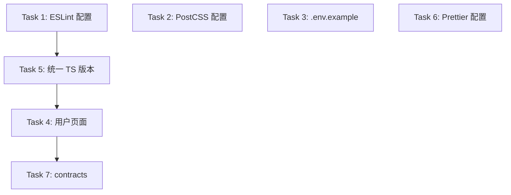

# AIWebStack 脚手架完善 - 设计文档

## 技术栈

**主要语言**: TypeScript 5.9.3
**框架**: Next.js 15, Turborepo 2
**数据库**: Prisma 7, PostgreSQL
**API**: tRPC 11
**UI**: Base UI 1.1.0, Tailwind CSS 4
**状态管理**: TanStack Query 5
**包管理**: pnpm 9

**开发工具**:
- Linter: ESLint 9
- Formatter: Prettier 3
- Type Checker: TypeScript 5.9.3

---

## 整体架构

```
aiwebstack-starter/
├── apps/
│   └── web/                 # Next.js 15 主应用
│       ├── src/
│       │   ├── app/         # App Router (RSC)
│       │   │   ├── users/   # 用户管理页面（需要完善）
│       │   │   └── ...
│       │   └── ...
│       ├── next.config.ts
│       ├── postcss.config.mjs  # 新增
│       └── package.json
│
├── packages/
│   ├── ui/                  # Base UI + Tailwind 组件库
│   ├── db/                  # Prisma 数据库层
│   ├── api/                 # tRPC API 层
│   ├── config/              # 共享配置
│   ├── contracts/           # 共享类型定义（完善）
│   └── utils/               # 共享工具函数
│
├── eslint.config.mjs        # 新增 - ESLint 9 根配置
├── .env.example             # 新增 - 根环境变量示例
├── .prettierrc              # 新增 - Prettier 配置
└── turbo.json
```

---

## 分层设计

### 配置层
- `eslint.config.mjs`: ESLint 9 扁平配置
- `.prettierrc`: 代码格式化规则
- `postcss.config.mjs`: PostCSS 配置（apps/web）

### 数据层
- Prisma Schema (`packages/db/prisma/schema.prisma`)
- 已有 User、Post 模型

### API 层
- tRPC 路由 (`packages/api/src/routers/`)
- 已有 user、post 路由

### UI 层
- @repo/ui 组件库
- @repo/ui/blocks 业务组件块
- apps/web 页面

---

## 模块依赖关系

```mermaid
graph TD
    A[apps/web] --> B[@repo/ui]
    A --> C[@repo/api]
    A --> D[@repo/db]
    C --> D
    B --> E[@repo/utils]
    C --> D
    C --> F[@repo/contracts]
```

---

## 实现任务拆分

### Task 1: 创建根目录 ESLint 配置
**输入契约**:
- packages/config/eslint-config.js 已存在
- 使用 ESLint 9 新格式

**输出契约**:
- 根目录 eslint.config.mjs
- 继承 @repo/config/eslint-config.js

**实现约束**:
- 使用 ESLint 9 扁平配置格式
- 配置智能排除目录（node_modules, dist, .next, build）

### Task 2: 创建 PostCSS 配置
**输入契约**:
- apps/web 已安装 postcss, autoprefixer, tailwindcss

**输出契约**:
- apps/web/postcss.config.mjs

**实现约束**:
- 配置 autoprefixer 和 tailwindcss

### Task 3: 创建根目录 .env.example
**输入契约**:
- packages/db/.env.example 已存在

**输出契约**:
- 根目录 .env.example

**实现约束**:
- 包含 NEXT_PUBLIC_APP_URL
- 包含 DATABASE_URL 说明

### Task 4: 完善用户管理页面
**输入契约**:
- packages/api/src/routers/user.ts 已有完整 CRUD 路由
- @repo/ui 组件库可用

**输出契约**:
- apps/web/src/app/users/page.tsx
  - 连接 tRPC API
  - 使用 @repo/ui 组件
  - 实现列表、新增、编辑、删除功能

**实现约束**:
- 使用 @repo/ui/components 组件
- 使用 tRPC hooks
- 保持代码质量（函数 < 50 行，文件 < 500 行）

### Task 5: 统一 TypeScript 版本
**输入契约**:
- 当前混用 TypeScript 5.7.2 和 5.9.3

**输出契约**:
- 所有 package.json 统一为 ^5.9.3

**实现约束**:
- 更新根目录和所有 packages 的 package.json
- 运行 pnpm install 同步

### Task 6: 创建 Prettier 配置
**输入契约**:
- 无

**输出契约**:
- 根目录 .prettierrc
- 根目录 .prettierignore

**实现约束**:
- 使用 2 空格缩进
- 单引号
- 无尾随逗号（与 ESLint 一致）

### Task 7: 完善 contracts 包
**输入契约**:
- packages/contracts 目录存在但为空

**输出契约**:
- packages/contracts/src/index.ts
- packages/contracts/package.json

**实现约束**:
- 导出共享类型定义
- 与 API 层类型同步

---

## 任务依赖图



---

## 代码质量约束

**强制规范**:
- 圈复杂度 < 10
- 嵌套层级 ≤ 3
- 文件行数 < 500
- 函数长度 < 50 行
- 参数数量 ≤ 5

**TypeScript 严格模式**:
- 启用所有严格检查
- 禁止 any

---

## 测试策略

由于本项目是脚手架完善，测试重点：
1. 开发服务器可正常启动
2. TypeScript 类型检查通过
3. ESLint 检查通过
4. 用户页面功能正常（手动验证）

---

## 验收标准

- [x] eslint.config.mjs 创建
- [x] postcss.config.mjs 创建
- [x] .env.example 创建
- [x] 用户页面连接真实 API
- [x] TypeScript 版本统一为 5.9.3
- [x] Prettier 配置创建
- [x] contracts 包完善
- [x] pnpm typecheck 通过
- [x] pnpm lint 通过
- [x] pnpm dev 正常启动
