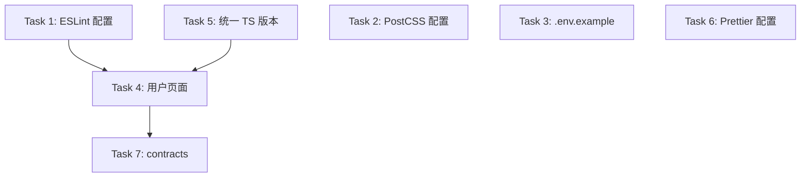

# AIWebStack 脚手架完善 - 任务拆分

## 技术栈确认

**主要语言**: TypeScript 5.9.3
**框架**: Next.js 15, Turborepo 2
**数据库**: Prisma 7, PostgreSQL
**API**: tRPC 11
**UI**: Base UI 1.1.0, Tailwind CSS 4
**包管理**: pnpm 9

**开发工具**:
- Linter: ESLint 9
- Formatter: Prettier 3
- Type Checker: TypeScript 5.9.3

---

## 原子任务列表

### Task 1: 创建根目录 ESLint 配置

**输入契约**:
- `packages/config/eslint-config.js` 已存在
- 使用 ESLint 9 新格式

**输出契约**:
- 根目录 `eslint.config.mjs`
- 继承 `@repo/config/eslint-config.js`

**实现约束**:
- 使用 ESLint 9 扁平配置格式 (`@eslint/flat-config`)
- 配置智能排除：node_modules, dist, .next, build, coverage
- 代码质量规则：圈复杂度 < 10, 文件 < 500 行

**依赖关系**: 无

---

### Task 2: 创建 PostCSS 配置

**输入契约**:
- `apps/web` 已安装 postcss, autoprefixer, tailwindcss

**输出契约**:
- `apps/web/postcss.config.mjs`

**实现约束**:
- 配置 autoprefixer 和 tailwindcss 插件

**依赖关系**: 无

---

### Task 3: 创建根目录 .env.example

**输入契约**:
- `packages/db/.env.example` 已存在

**输出契约**:
- 根目录 `.env.example`

**实现约束**:
- 包含 NEXT_PUBLIC_APP_URL
- 包含 DATABASE_URL 说明
- 添加必要的注释

**依赖关系**: 无

---

### Task 4: 完善用户管理页面

**输入契约**:
- `packages/api/src/routers/user.ts` 已有完整 CRUD 路由
- `@repo/ui` 组件库可用
- Prisma Schema 已定义 User 模型

**输出契约**:
- `apps/web/src/app/users/page.tsx`
  - 连接 tRPC API
  - 使用 `@repo/ui` 组件（Button, Dialog, Table, FormCard 等）
  - 实现列表、新增、编辑、删除功能
  - 代码质量符合规范

**实现约束**:
- 使用 `@repo/ui/components` 组件
- 使用 tRPC hooks (`api.user.list`, `api.user.create` 等)
- 保持代码质量：函数 < 50 行，文件 < 500 行，复杂度 < 10

**依赖关系**:
- 前置: Task 1 (ESLint 配置)
- 前置: Task 5 (TypeScript 版本统一)

---

### Task 5: 统一 TypeScript 版本

**输入契约**:
- 当前混用 TypeScript 5.7.2 和 5.9.3

**输出契约**:
- 所有 package.json 统一为 `^5.9.3`
- 运行 `pnpm install` 同步依赖

**实现约束**:
- 更新文件：
  - `package.json` (根目录)
  - `apps/web/package.json`
  - `packages/ui/package.json`
  - `packages/api/package.json`
  - `packages/config/package.json`
  - `packages/utils/package.json`
  - `packages/db/package.json`

**依赖关系**: 无

---

### Task 6: 创建 Prettier 配置

**输入契约**:
- 无

**输出契约**:
- 根目录 `.prettierrc`
- 根目录 `.prettierignore`

**实现约束**:
- 使用 2 空格缩进
- 单引号
- 无尾随逗号（与 ESLint 一致）
- 排除 node_modules, dist, .next, build

**依赖关系**: 无

---

### Task 7: 完善 contracts 包

**输入契约**:
- `packages/contracts` 目录存在但为空

**输出契约**:
- `packages/contracts/src/index.ts`
- `packages/contracts/package.json`

**实现约束**:
- 导出共享类型定义
- 与 API 层类型同步

**依赖关系**:
- 前置: Task 4 (用户页面完成后，提取共享类型)

---

## 任务依赖图

---

## 执行顺序

1. Task 5: 统一 TypeScript 版本（基础）
2. Task 1: 创建 ESLint 配置
3. Task 2: 创建 PostCSS 配置
4. Task 3: 创建 .env.example
5. Task 6: 创建 Prettier 配置
6. Task 4: 完善用户管理页面
7. Task 7: 完善 contracts 包

---

## 质量检查标准

每个任务完成后需要验证：
- TypeScript 类型检查通过 (`pnpm typecheck`)
- ESLint 检查通过 (`pnpm lint`)
- 代码复杂度 < 10
- 文件行数 < 500
- 函数长度 < 50 行
